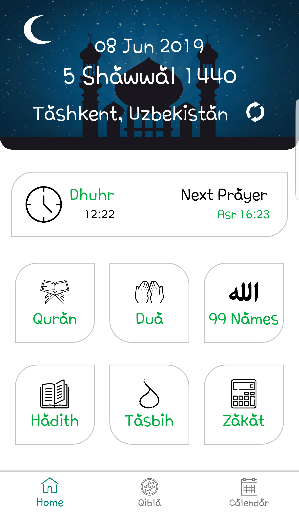
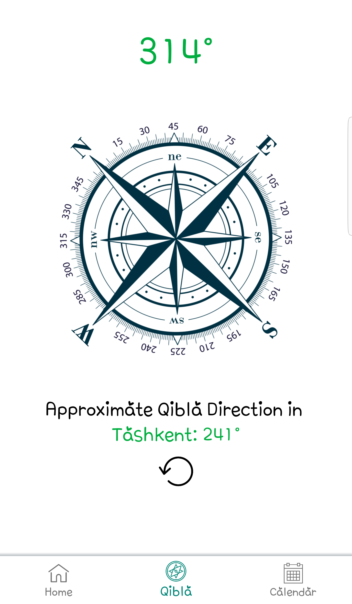
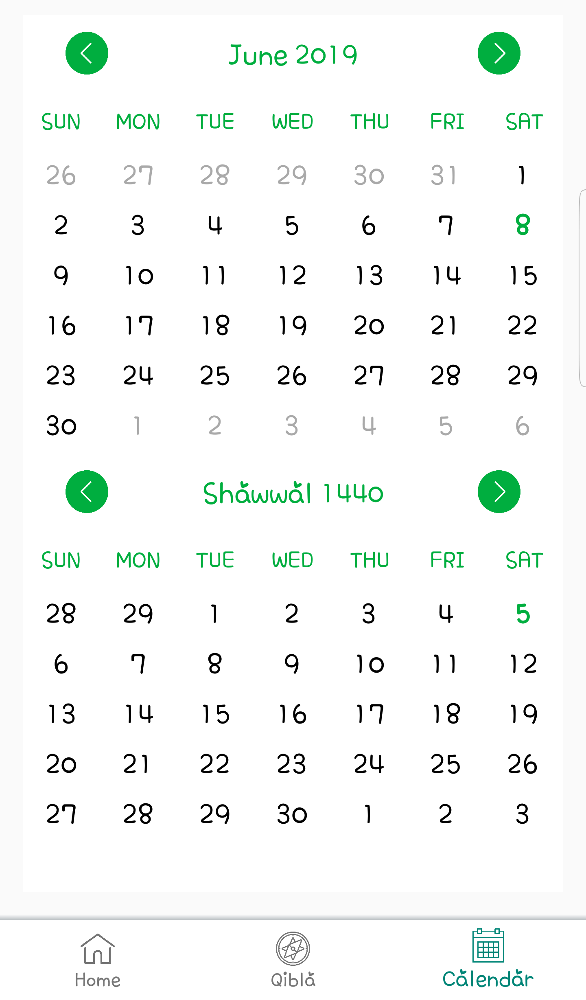

# Al-Adhan
Muslim Prayer application.

As soon as application launched HTTP GET request is sent to the http://api.aladhan.com and prayer times are fetched.
Default city values are set beforehand. Updating location will also update prayer times accordingly.

 

<i><b>Compass</b></i> provides bearing from given location to the Kaaba.

Islamic calendar and Gregorian calendar are shown in one page.

